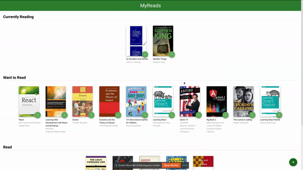

<p align="center">
  <a href="https://github.com/ilyeSudo/my-reads-library">
    
  </a>

  <h3 align="center">My Reads Library</h3>

  <p align="center">
    Keep track of your reading habit!
    <br />
    Udacity's <a href="https://www.udacity.com/course/r eact-nanodegree--nd019">React Nanodegree</a> 1st Project
    <br />
    <br />
    <a href="https://ilyesudo-myreads.netlify.app">View Demo</a>
    ·
    <a href="https://github.com/ilyeSudo/my-reads-library/issues">Report Bug</a>
    ·
    <a href="https://github.com/ilyeSudo/my-reads-library/issues">Request Feature</a>
  </p>
</p>

&emsp; &emsp; &emsp; &emsp; &emsp; &emsp; &emsp; &emsp; &emsp; &emsp; &emsp; &emsp; &emsp; &emsp; &emsp; &emsp; &emsp; &emsp; &emsp; [](https://app.netlify.com/sites/ilyesudo-myreads/deploys)

## Table of Contents

- [About the Project](#about-the-project)
  - [Live Demo](#live-demo)
  - [GIF Demo](#gif-demo)
  - [User Experience](#user-experience)
  - [Built With](#built-with)
  - [Important](#important)
  - [Backend](#backend)
    - [Fetch](#backend)
    - [Upadate](#backend)
    - [Search](#backend)
- [Getting Started](#getting-started)
  - [Prerequisites](#prerequisites)
  - [Installation](#installation)
- [Contributing](#contributing)
- [Author](#author)
- [Acknowledgements](#acknowledgements)
- [License](#license)

## About The Project

### [Live Demo](https://ilyesudo-myreads.netlify.app)

### GIF Demo



### User Experience

My Reads allows you to search for books using specific search terms (found in SEARCH_TERMS.md). The books are stored in one of three bookshelves:

- Currently Reading
- Want to Read
- Read

The backend is provided by and run by Udacity.

### Built With

- [React](https://www.github.com/facebook/react) - A JavaScript library for building user interfaces
- [React Router](https://github.com/ReactTraining/react-router) - Declarative routing for React
- [Redux](https://github.com/reduxjs/redux) - Predictable state container for JavaScript apps

### Important

Starter project files by Udacity: https://github.com/udacity/reactnd-project-myreads-starter

The backend API uses a fixed set of cached search results and is limited to a particular set of search terms, which can be found in [SEARCH_TERMS.md](SEARCH_TERMS.md). That list of terms are the _only_ terms that will work with the backend, so don't be surprised if your searches for Basket Weaving or Bubble Wrap don't come back with any results.

### Backend

To simplify your development process, we've provided a backend server for you to develop against. The provided file [`BooksAPI.js`](src/Utils/BooksAPI.js) contains the methods you will need to perform necessary operations on the backend:

#### `getAll()`

- Returns a Promise which resolves to a JSON object containing a collection of book objects.
- This collection represents the books currently in the bookshelves in your app.

#### `update(book, shelf)`

- book: `<Object>` containing at minimum an `id` attribute
- shelf: `<String>` contains one of ["wantToRead", "currentlyReading", "read"]
- Returns a Promise which resolves to a JSON object containing the response data of the POST request

#### `search(query, maxResults)`

- query: `<String>`
- maxResults: `<Integer>` Due to the nature of the backend server, search results are capped at 20, even if this is set higher.
- Returns a Promise which resolves to a JSON object containing a collection of book objects.
- These books do not know which shelf they are on. They are raw results only. You'll need to make sure that books have the correct state while on the search page.

## Getting Started

### Prerequisites

This is an example of how to list things you need to use the software and how to install them.

- `yarn` or `npm`, I highly recommand the former!

```sh
sudo apt update && sudo apt install yarn
```

```sh
npm install npm@latest -g
```

### Installation

1. Clone the repo

```sh
git clone https://github.com/ilyeSudo/my-reads-library.git
```

2. Install project packages

```sh
yarn install
```

3. Launch the project and view it at `localhost:3000`

```sh
yarn start
```

## Contributing

Contributions are what make the open source community such an amazing place to be learn, inspire, and create. Any contributions you make are **greatly appreciated**.

1. Fork the Project
2. Create your Feature Branch (`git checkout -b feature/AmazingFeature`)
3. Commit your Changes (`git commit -m 'Add some AmazingFeature'`)
4. Push to the Branch (`git push origin feature/AmazingFeature`)
5. Open a Pull Request

## Author

- **Ilyes Houdjedje** - [Linkedin](https://www.linkedin.com/in/ilyes-houdjedje) - [Github](https://github.com/ilyeSudo) - [Twitter](https://twitter.com/ilyesudo)

## Acknowledgments

- [Mr.Tyler McGinnis](https://twitter.com/tylermcginn) for the great course and to all the Udacity team!

## License

This project is licensed under the MIT License - see the [LICENSE.md](LICENSE.md) file for details
